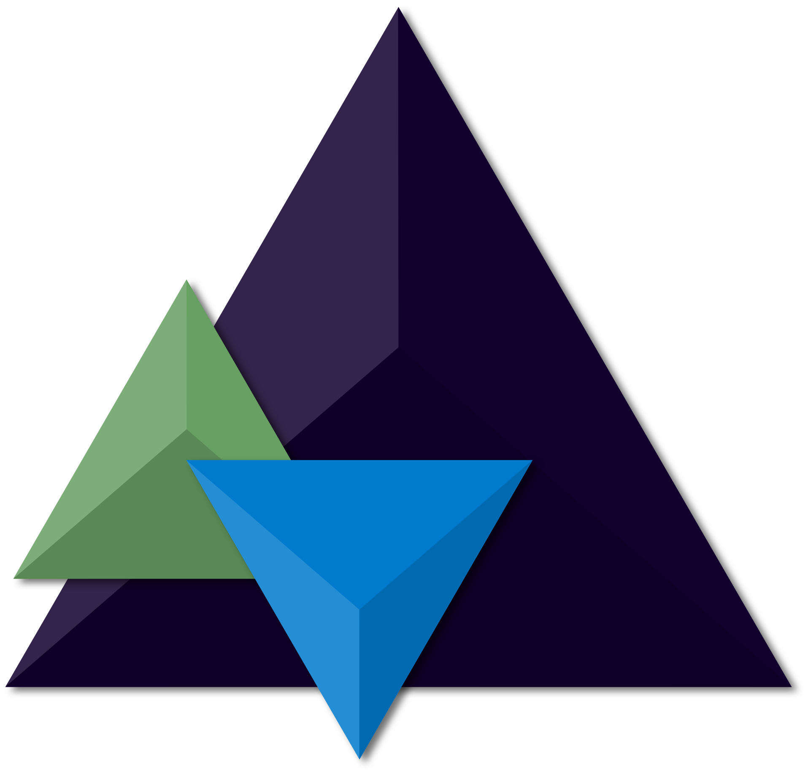

<div align="center">
  <a href="https://github.com/Eukalyptus-Dreizack/deepcity-framework">
    <!---->
    
  </a>

  <br><br>

  [![travis][travis]][travis-url]

  [![package-version][package-version]][package-url]
  [![node-version][node-version]][node-url]
  [![pnpm-version][pnpm-version]][pnpm-url]

  [![commit-info][commit-info]][commit-url]
  [![contributors-info][contributors-info]][contributors-url]
  ![repo-size-info][repo-size-info]

  <br><hr><br>

# DeepCity
~ Is a TypeScript framework for making Discord Bots ~  
Easy to **use**, to **expand** and it's blazingly **fast**

<br>

</div>

## DeepCity: 

Please be patient, the project will start soon and a more detailed readme will follow.

## Getting Started:  

### Prerequisites:

- Download **Node.js** with **npm** 

### Clone GitHub Repository:

```bash
git clone https://github.com/Eukalyptus-Dreizack/deepcity-framework.git
```  

### Dependencies:

1. Install **pnpm**
```bash
npm i -g pnpm 
```
2. Install **all dependencies** with **pnpm**
```bash
pnpm i
```

## Contributing

If you want to take part in contribution, like fixing issues and contributing directly to the code base, plase visit the [How to Contribute](/CONTRIBUTING.md "Learn how to Contribute") document, which covers such things as:  

- [Contributing your first time :D](/CONTRIBUTING.md#first-time-contributors)
- [Questions, bugs and feature requests](/CONTRIBUTING.md#dealing-with-questions-bugs-and-feature-requests)
- [Contributing Code](/CONTRIBUTING.md#contributing-code)
- [Pull requests, branching and commits](/CONTRIBUTING.md#pull-requests-branching-and-commits)

## Useful links:
[License](/LICENSE "License") - 
[Contributing](/CONTRIBUTING.md "Contributing") - 
[Code of conduct](/CODE_OF_CONDUCT.md "Code of conduct") - 
[Issues](https://github.com/Eukalyptus-Dreizack/deepcity-framework/issues "Issues") - 
[Pull requests](https://github.com/Eukalyptus-Dreizack/deepcity-framework/pulls "Pull Requests")

<hr>  

###### Copyright (c) Eukalyptus-Dreizack. All rights reserved | Licensed under the MIT license. | 2019 - today

[travis]: https://img.shields.io/travis/com/Eukalyptus-Dreizack/deepcity-framework/develop?style=flat-square
[travis-url]: https://travis-ci.org/Eukalyptus-Dreizack/deepcity-framework


[package-version]: https://img.shields.io/github/package-json/v/Eukalyptus-Dreizack/deepcity-framework/develop?style=flat-square
[package-url]: /package.json

[node-version]: https://img.shields.io/badge/dynamic/json?url=https://raw.githubusercontent.com/Eukalyptus-Dreizack/deepcity-framework/develop/package.json&label=node&query=$.engines.node&color=orange&style=flat-square
[node-url]: /package.json

[pnpm-version]: https://img.shields.io/badge/dynamic/json?url=https://raw.githubusercontent.com/Eukalyptus-Dreizack/deepcity-framework/develop/package.json&label=pnpm&query=$.engines.pnpm&color=orange&style=flat-square
[pnpm-url]: /package.json


[commit-info]: https://img.shields.io/github/last-commit/Eukalyptus-Dreizack/deepcity-framework?style=flat-square
[commit-url]: https://github.com/Eukalyptus-Dreizack/deepcity-framework/commits

[contributors-info]: https://img.shields.io/github/contributors/Eukalyptus-Dreizack/deepcity-framework?style=flat-square
[contributors-url]: https://github.com/Eukalyptus-Dreizack/deepcity-framework/contributors?style=flat-square

[repo-size-info]: https://img.shields.io/github/repo-size/Eukalyptus-Dreizack/deepcity-framework?style=flat-square